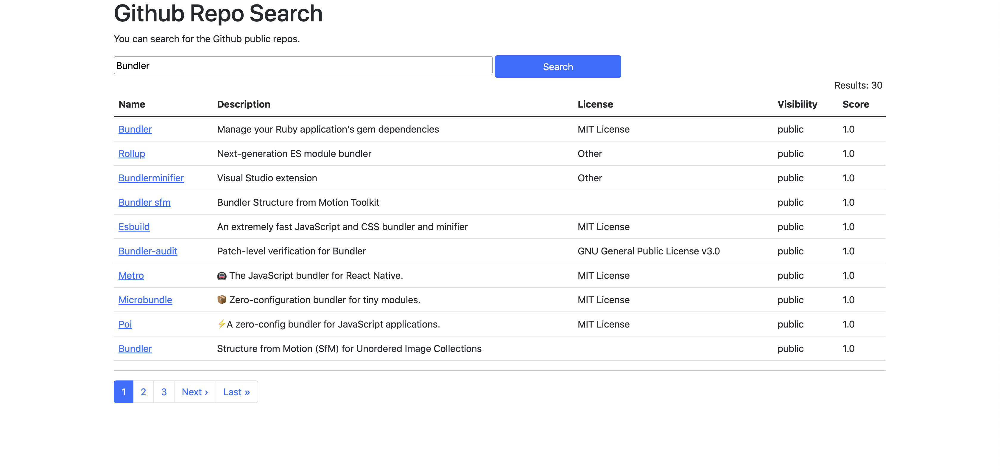
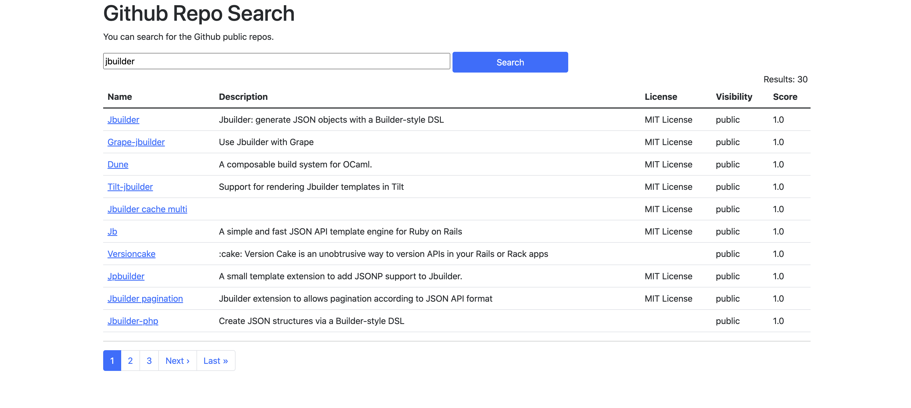

# GithubRepoSearch

GithubRepoSearch is a simple Ruby based application for searching repos from Github using GitHub APIs.

## Steps for Installation

1. Download the project
   - Ruby Version: ruby 3.1.1
   - Rails Version: Rails 7.0.2.4
2. Install Gems
```bash
bundle install
```
3. Start Rails Server
```bash
rails s
```

### Sample Image 1:

### Sample Image 2:

### Sample Image 3:


